# SkillChain — Blockchain-Based Student Skill Verification and Talent Discovery Platform

> A cryptographically verified academic credential ledger, deterministic talent discovery engine, and interactive skill pathway platform built for higher education and enterprise recruitment.

---

## Table of Contents

- [1. Project Overview](#1-project-overview)
  - [Problem Statement](#problem-statement)
  - [Project Objectives](#project-objectives)
  - [Key Platform Features](#key-platform-features)
  - [Target Personas and User Ecosystem](#target-personas-and-user-ecosystem)
  - [Platform Workflow](#platform-workflow)
- [2. Problem Statement and Objectives](#2-problem-statement-and-objectives)
- [3. Key Features](#3-key-features)
- [4. Technology Stack](#4-technology-stack)
- [5. Five Main Modules and Team Responsibilities](#5-five-main-modules-and-team-responsibilities)
- [6. System Architecture Diagram](#6-system-architecture-diagram)
- [7. UML and System Design](#7-uml-and-system-design)
  - [A. Domain Class Diagram](#a-domain-class-diagram)
  - [B. System Use-Case Diagram](#b-system-use-case-diagram)
  - [C. Certificate Upload & Cryptographic Verification Sequence Diagram](#c-certificate-upload--cryptographic-verification-sequence-diagram)
  - [D. Recruiter Candidate-Ranking Sequence Diagram](#d-recruiter-candidate-ranking-sequence-diagram)
  - [E. Dijkstra Learning Pathway Sequence Diagram](#e-dijkstra-learning-pathway-sequence-diagram)
- [8. Screenshots and User Interface](#8-screenshots-and-user-interface)
  - [Interface Catalog & Visual Specifications](#interface-catalog--visual-specifications)
  - [Screenshot Verification & Capture Checklist](#screenshot-verification--capture-checklist)
- [9. Feature Implementation Details](#9-feature-implementation-details)
  - [Module 1: Backend, REST APIs and System Architecture](#module-1-backend-rest-apis-and-system-architecture)
  - [Module 2: Frontend Development and UI/UX](#module-2-frontend-development-and-uiux)
  - [Module 3: Blockchain and Certificate Verification](#module-3-blockchain-and-certificate-verification)
  - [Module 4: DSA, Skill Graph and Recommendation System](#module-4-dsa-skill-graph-and-recommendation-system)
  - [Module 5: Database, Security, Testing and 3D Visualization](#module-5-database-security-testing-and-3d-visualization)
- [10. 12-Week Development Plan](#10-12-week-development-plan)
- [11. Team Contributions](#11-team-contributions)
- [12. Database and Project Structure](#12-database-and-project-structure)
  - [Database Schema (MySQL)](#database-schema-mysql)
  - [Repository Directory Structure](#repository-directory-structure)
- [13. Installation and Setup](#13-installation-and-setup)
  - [Prerequisites](#prerequisites)
  - [Database Initialization](#database-initialization)
  - [Backend Setup & Execution](#backend-setup--execution)
  - [Frontend Setup & Execution](#frontend-setup--execution)
- [14. API Overview and Application Routes](#14-api-overview-and-application-routes)
  - [Backend REST Endpoints Summary](#backend-rest-endpoints-summary)
  - [Frontend Application Routes Inventory](#frontend-application-routes-inventory)
- [15. Testing and Results](#15-testing-and-results)
  - [Backend Test Suite (Audit Report Attribution)](#backend-test-suite-audit-report-attribution)
  - [Frontend Production Build & Routing Validation (Audit Report Attribution)](#frontend-production-build--routing-validation-audit-report-attribution)
- [16. Security Considerations](#16-security-considerations)
- [17. Limitations and Future Improvements](#17-limitations-and-future-improvements)

---

## 1. Project Overview

**SkillChain** is a full-stack academic credential verification and talent discovery platform engineered to bridge the trust gap between graduating students, academic institutions, and technical recruiters. It integrates a custom SHA-256 hash-linked, tamper-evident credential ledger, in-memory weighted graph algorithms, deterministic candidate ranking, and an interactive 3D skill network into a unified educational technology ecosystem.

### Problem Statement
Traditional resumes and unverified online portfolios face critical structural limitations:
1. **Unverifiable Credentials and Credential Inflation:** Candidate resumes frequently list unverified technical proficiencies or unauthenticated course certificates, while manual institutional verification remains slow, fragmented, and resource-intensive.
2. **Disconnected Skill Portfolios:** Technical skills cited on resumes often lack tangible contextual evidence, such as demonstrated project source code, active deployment URLs, and cryptographically anchored certificates.
3. **Suboptimal Recruiter Filtering:** Conventional keyword-matching applicant tracking systems (ATS) reward keyword repetition rather than demonstrable technical depth, often overlooking qualified candidates who do not match specific phrasing.
4. **Opaque Student Learning Trajectories:** Students frequently lack structured, algorithmic guidance showing which specific technical competencies to acquire next to bridge their profiles to modern industry requirements.

### Project Objectives
- **Cryptographic Trust:** Implement a custom SHA-256 hash-linked, tamper-evident ledger that anchors certificate metadata and PDF document checksums directly in the database.
- **Deterministic Recruiter Scoring:** Remove subjective candidate screening through a multi-factor ranking algorithm (50% Skill Match, 25% Proficiency Depth, 15% Project Relevance, 10% Blockchain Verification).
- **Algorithmic Learning Guidance:** Implement Dijkstra's shortest-path algorithm and breadth-first search (BFS) over an in-memory weighted directed skill graph to compute structured learning pathways.
- **Unified Talent Discovery:** Provide recruiters with candidate dossiers that aggregate student academic records, verified GitHub repositories, live demo URLs, and cryptographic certificate proofs.
- **Public, Zero-Login Certificate Verification:** Provide a public, zero-login certificate verification portal where employers and academic bodies can verify any student credential using its Credential ID, SHA-256 certificate fingerprint, or block hash without requiring an account.

### Key Platform Features
- **Stateless JWT & Role-Based Access Control:** Role segregation for `STUDENT`, `RECRUITER`, and `ADMIN` users with BCrypt password hashing. Public self-service registration supports Students and Recruiters; Administrator accounts are not accessible via public registration and must be provisioned via the application's secure startup bootstrapper in `SkillChainApplication.java`.
- **Student Portfolio Hub:** Profile customization, technical skills inventory (Beginner to Expert), project showcases with live demo links, and certificate PDF uploads.
- **Custom SHA-256 Hash-Linked Ledger:** Chronological block chaining (`previousHash` -> `hash`) with automated tamper detection and cryptographic chain audits.
- **Public, Zero-Login Certificate Verification:** Instant verification of credential authenticity, issuing organization, issuance timestamp, and revocation status without requiring an account or login.
- **Dijkstra Learning Pathway Engine:** Minimum-cost path computation between any source skill and target skill with human-readable pedagogical milestone explanations.
- **Deterministic 4-Factor Candidate Ranking:** Mathematical evaluation of candidate suitability for recruiter-defined skill combinations with scoring explanations.
- **Interactive 3D Skill Network Canvas:** Perspective-projected 3D skill graph running on HTML5 Canvas with drag-to-orbit, zoom, and raycasting inspection.
- **Administrative Telemetry & Governance:** Platform-wide metrics, user account status toggling, skill taxonomy monitoring, and certificate revocation.

### Target Personas and User Ecosystem

| Persona | Primary Needs & Platform Capabilities |
|---|---|
| **Students** | Construct comprehensive profiles, document skills and projects, upload certificate PDFs for automated ledger anchoring, explore personalized skill recommendations, and generate shortest-path learning pathways. |
| **Recruiters** | Search talent using multi-skill filters, evaluate candidates using deterministic 4-factor scoring, review candidate dossiers, and inspect cryptographic certificate proofs and uploaded documents. |
| **Administrators** | Oversee platform telemetry, audit blockchain ledger integrity, revoke fraudulent credentials with audit logs, manage user accounts, and maintain canonical skill taxonomy. |
| **Public Verifiers** | Instantly verify any student credential using a public URL (`/verify`) via Credential ID or SHA-256 hash without registering or logging in. |

### Platform Workflow

```
[Student Profile & Skills] ──> [Project Portfolio & PDF Certs]
                                         │
                                         ▼
                   [Custom SHA-256 Hash-Linked Ledger] ──> [Public Verification Portal]
                                         │
                                         ▼
[Weighted Skill Graph Engine] ──> [Dijkstra Pathway & Recruiter Ranking] ──> [Recruiter Dossier]
```

---

## 2. Problem Statement and Objectives

In modern higher education and technical hiring, credential verification remains predominantly manual and vulnerable to misrepresentation. Academic institutions lack low-overhead tools to issue cryptographically verifiable credentials, while recruiters expend significant resources screening applicant claims without standardized proof.

SkillChain addresses this challenge through three core objectives:
1. **Mathematical Verifiability:** Provide cryptographic verification by generating a canonical SHA-256 fingerprint for every certificate record (`title|issuingOrg|issueDate|credentialId|studentEmail|fileHash`) and embedding it within a sequential, tamper-evident hash-linked block sequence.
2. **Context-Rich Talent Discovery:** Give recruiters direct visibility into candidate capabilities through an integrated profile combining academic degree status, verified skills, real-world project portfolios, and cryptographic credentials.
3. **Pedagogical Career Acceleration:** Guide students from foundational skills (e.g., Java) to advanced industry specializations (e.g., Microservices) via shortest-path algorithms over a weighted technical knowledge graph.

---

## 3. Key Features

- **Role-Based Workspaces:** Dedicated, authenticated environments tailored for Students, Recruiters, and Administrators.
- **Cryptographic Credential Anchoring:** Auto-anchors certificate records to an internal hash-linked ledger upon creation or PDF upload.
- **Tamper Detection & Audit:** Backend ledger verification engine recalculates SHA-256 hashes sequentially across all blocks to detect modified records.
- **Public, Zero-Login Certificate Verification:** Lookup by Credential ID, SHA-256 fingerprint, or block hash with full verification status reporting without requiring user authentication.
- **Deterministic Recruiter Ranking:** Real-time multi-skill candidate evaluation utilizing a transparent formula (50% Coverage, 25% Proficiency, 15% Projects, 10% Blockchain Verification).
- **Candidate Dossier:** Comprehensive recruiter view showing contact info, GitHub/LinkedIn links, verified projects, and downloadable certificate PDFs.
- **Dijkstra Shortest-Path Learning Curricula:** Step-by-step skill transition roadmap with edge weights and pedagogical explanations.
- **Personalized Skill Synergy Recommendations:** Graph-based discovery of high-value adjacent skills not yet possessed by the student.
- **3D Perspective-Projected Skill Graph:** HTML5 Canvas interactive 3D network with spherical coordinates, depth sorting, drag-to-orbit, and zoom.
- **Administrative Governance:** System telemetry, user activation/deactivation, account deletion, and certificate revocation.

---

## 4. Technology Stack

The SkillChain technology stack was verified against the current codebase:

| Technology | Category | Version | Purpose in SkillChain | Associated Module |
|---|---|---|---|---|
| **Java** | Backend Runtime | 21 LTS | Enterprise runtime providing pattern matching, virtual thread support, and strict type safety | Module 1 |
| **Spring Boot** | Application Framework | 3.3.4 | Core REST API framework, dependency injection, and transaction management | Module 1 |
| **Maven** | Build System | 3.9+ | Backend dependency resolution, lifecycle build automation, and test runner | Module 1 |
| **Spring Security** | Security Framework | 6.3.x | Stateless HTTP security filter chain, endpoint authorization, and principal extraction | Module 1 & 5 |
| **JJWT (io.jsonwebtoken)** | Authentication | 0.12.6 | Cryptographic signing and parsing of HMAC-SHA256 (HS256) JSON Web Tokens | Module 1 & 5 |
| **BCrypt** | Cryptography | Embedded in Spring Security | Adaptive one-way password hashing with per-user salt generation | Module 1 & 5 |
| **MySQL** | Relational Database | 8.0+ | ACID-compliant storage for users, profiles, skills, projects, certificates, and blockchain blocks | Module 5 |
| **Spring Data JPA / Hibernate** | ORM Persistence | 6.x | Entity mappings, repository interfaces, JPQL queries, and schema migration | Module 5 |
| **Next.js** | Frontend Framework | 14.2.15 | Full-stack React framework utilizing the App Router architecture and server layouts | Module 2 |
| **React** | UI Library | 18.3.1 | Declarative component hierarchy, client hooks, and state reconciliation | Module 2 |
| **TypeScript** | Language | 5.6.3 | Static type safety across frontend REST API clients, DTOs, and component contracts | Module 2 |
| **Tailwind CSS** | Styling System | 3.4.14 | Utility-first CSS configured with custom color tokens (`#F8F7F3`, `#191919`, `#5555A5`) | Module 2 |
| **Lucide React** | Iconography | 0.453.0 | Lightweight vector iconography across all dashboard screens | Module 2 |
| **HTML5 Canvas (2D Context)** | 3D Visualization | Native Web API | Math-driven 3D perspective projection, spherical orbit rotation, and interactive raycasting | Module 5 & 2 |
| **SHA-256 (`MessageDigest`)** | Cryptography | JDK `java.security` | Cryptographic canonical fingerprinting of certificate metadata and block chaining | Module 3 |
| **Graph Algorithms (BFS/DFS/Dijkstra)** | Data Structures & Algorithms | Custom Java Collections | In-memory weighted skill graph, shortest-path calculation, and deterministic candidate scoring | Module 4 |
| **Multipart File Storage** | File Handling | Spring `MultipartFile` & `Path` | Secure disk storage, PDF validation, and cryptographic file hashing | Module 1 & 3 |

---

## 5. Five Main Modules and Team Responsibilities

The SkillChain platform is divided into five core architectural modules:

```
┌──────────────────────────────────────────────────────────────────────────────────┐
│                             SKILLCHAIN ARCHITECTURE                              │
├─────────────────────────┬───────────────────────────────┬────────────────────────┤
│  MODULE 1               │  MODULE 2                     │  MODULE 3              │
│  Backend & REST APIs    │  Frontend & UI/UX             │  Blockchain & Ledger   │
│  Ritunjai Khuteta       │  Vanshika Bansal              │  Sunidhi Kataria       │
├─────────────────────────┼───────────────────────────────┼────────────────────────┤
│  MODULE 4               │  MODULE 5                                              │
│  DSA, Graph & Ranking   │  Database, Security, Testing & 3D Visualization        │
│  Vivek Sharma           │  Yash Gupta                                            │
└─────────────────────────┴────────────────────────────────────────────────────────┘
```

### Module 1: Backend, REST APIs and System Architecture
- **Primary Owner:** **Ritunjai Khuteta**
- **Core Architecture & Scope:**
  - Architecture of the decoupled Spring Boot 3.3.4 monorepo backend.
  - Design and implementation of RESTful API endpoints across all domains: authentication, student profiles, skills, projects, certificates, recruiter queries, admin management, and public verification.
  - Centralized global error handling (`GlobalExceptionHandler` via `@RestControllerAdvice`) emitting uniform RFC-compliant JSON responses with validation field error mappings.
  - Coordination between data persistence, cryptographic services, algorithmic graph engines, and disk file storage.
  - REST endpoints and backend API documentation (`docs/API_DOCUMENTATION.md`).

### Module 2: Frontend Development and UI/UX
- **Primary Owner:** **Vanshika Bansal**
- **Core Architecture & Scope:**
  - Development of the Next.js 14 App Router user interface with React 18 and TypeScript.
  - Design system implementation adhering to the platform's warm ivory visual identity (`#F8F7F3` background, `#191919` primary text, `#5555A5` brand accent).
  - Implementation of all interactive screens across Public, Student, Recruiter, and Administrator workspaces.
  - Client-side session management via `AuthContext`, synchronizing JWT tokens with `localStorage` and attaching Bearer authorization headers.
  - Form validation, loading skeletons, responsive navigation (`Navbar`, `Sidebar`), and modal dialogs for CRUD operations.

### Module 3: Blockchain and Certificate Verification
- **Primary Owner:** **Sunidhi Kataria**
- **Core Architecture & Scope:**
  - Custom SHA-256 hash-linked, tamper-evident ledger model (`BlockchainBlock` entity and `BlockchainService`).
  - Canonical certificate fingerprint calculation combining metadata and uploaded PDF file hashes (`title|issuingOrg|issueDate|credentialId|studentEmail|fileHash`).
  - Genesis block initialization (`blockIndex: 0`, `previousHash: 0000...0000`) and sequential block anchoring.
  - End-to-end chain integrity verification algorithm (`validateEntireChain`) to detect tampered hashes or broken linkage.
  - Certificate revocation workflow with tamper-evident audit metadata (`revokedAt`, `revokedBy`, `revocationReason`).
  - Public verification API (`/api/certificates/verify/*`) providing verification by Credential ID, Fingerprint, or Block Hash.

### Module 4: DSA, Skill Graph and Recommendation System
- **Primary Owner:** **Vivek Sharma**
- **Core Architecture & Scope:**
  - In-memory weighted skill graph representing technical disciplines (Java, Web, Python/AI, DevOps, Data & Cloud).
  - Breadth-First Search (BFS) and Depth-First Search (DFS) graph traversal algorithms.
  - Dijkstra's shortest-path algorithm using a `PriorityQueue` to compute minimum-cost learning pathways between skills.
  - Automated generation of pedagogical transition explanations for each learning pathway step.
  - Deterministic 4-Factor Recruiter Candidate-Ranking Engine:
    - **Skill Match Coverage:** 50%
    - **Proficiency Depth:** 25%
    - **Project Relevance:** 15%
    - **Blockchain-Verified Certificates:** 10%
  - Personalized skill synergy recommendations for students based on graph proximity.

### Module 5: Database, Security, Testing and 3D Visualization
- **Primary Owner:** **Yash Gupta**
- **Core Architecture & Scope:**
  - MySQL 8 relational database schema design, indexing strategies, and JPA entity relationship management.
  - Spring Security 6.x stateless filter chain configuration and BCrypt password encryption.
  - JWT generation, signature verification (HS256), and role-based route guard enforcement (`ROLE_STUDENT`, `ROLE_RECRUITER`, `ROLE_ADMIN`).
  - HTML5 Canvas 3D interactive skill network engine featuring perspective projection, spherical orbit rotation, zoom controls, and depth sorting.
  - Test suite coordination and quality checks (31 automated tests documented in audit report).
  - Monorepo production build optimization, database integrity checks, and security audits.

---

## 6. System Architecture Diagram

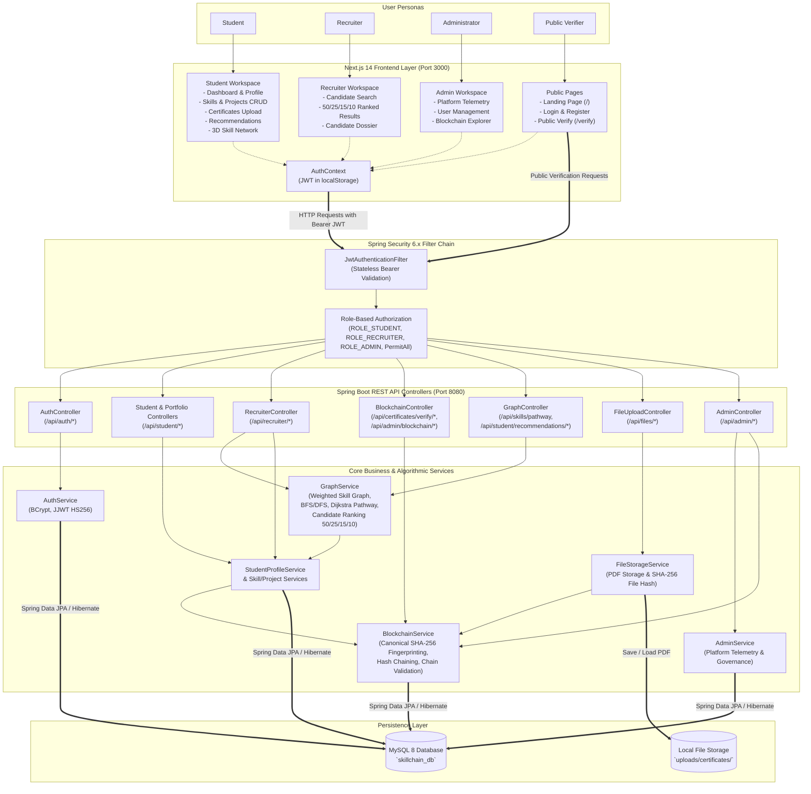

---

## 7. UML and System Design

### A. Domain Class Diagram

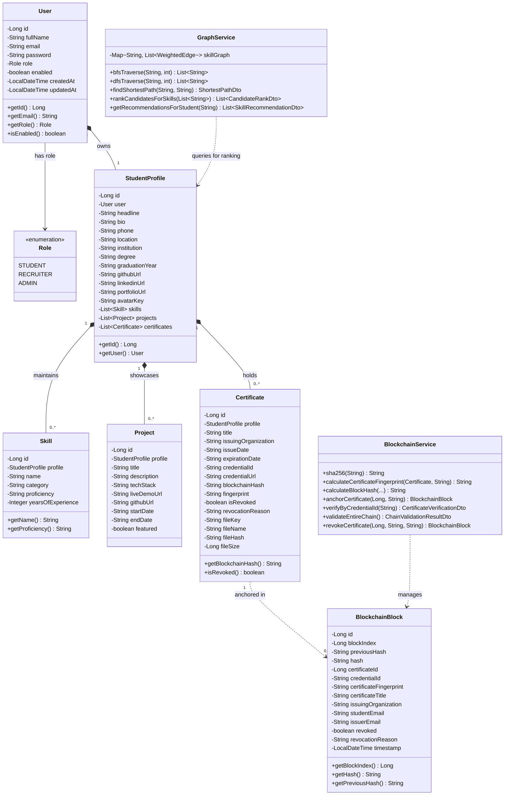

---

### B. System Use-Case Diagram

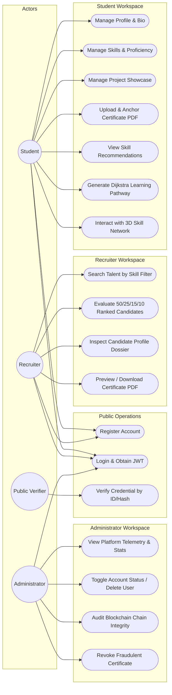

---

### C. Certificate Upload & Cryptographic Verification Sequence Diagram

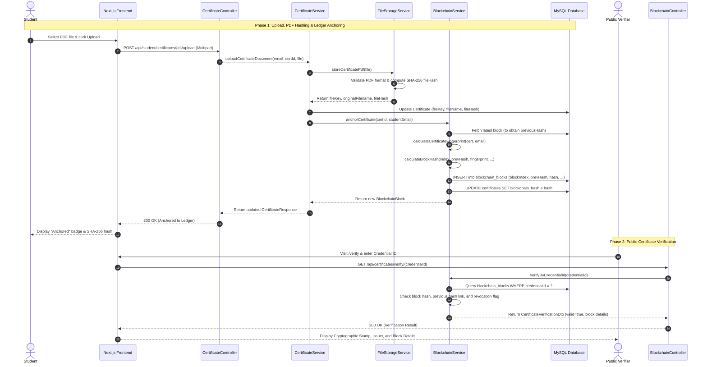

---

### D. Recruiter Candidate-Ranking Sequence Diagram

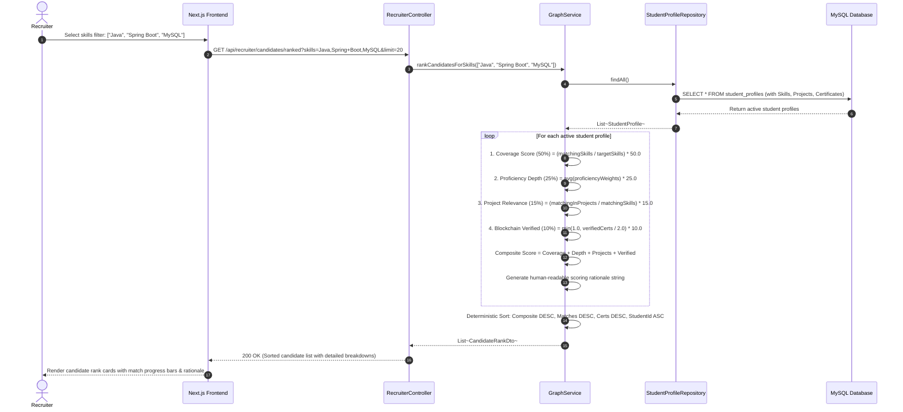

---

### E. Dijkstra Learning Pathway Sequence Diagram

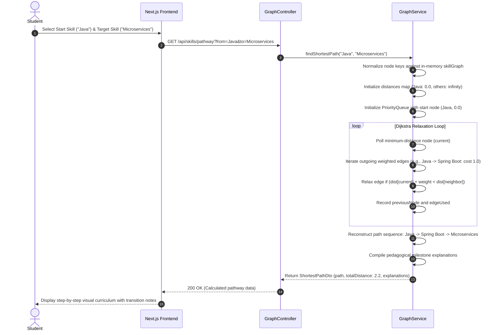

---

## 8. Screenshots and User Interface

> **Screenshot Verification Notice:**
> All 12 core application screens have been captured directly from the running SkillChain platform (Spring Boot 3.3.4 backend + Next.js 14 frontend + MySQL 8 ledger database) at authentic 1920x1080 resolution. The screenshots are stored under `docs/screenshots/` and embedded below.

### Interface Catalog & Visual Specifications

#### 1. Landing Page
- **Route:** `/`
- **File:** `docs/screenshots/landing-page.png`
- **Status:** `[Captured & Verified (1920x1080 PNG)]`
- **Visual Description:** Public landing page featuring the interactive HTML5 3D talent network hero, platform value proposition pillars, 3-step credential verification workflow, and guest navigation.

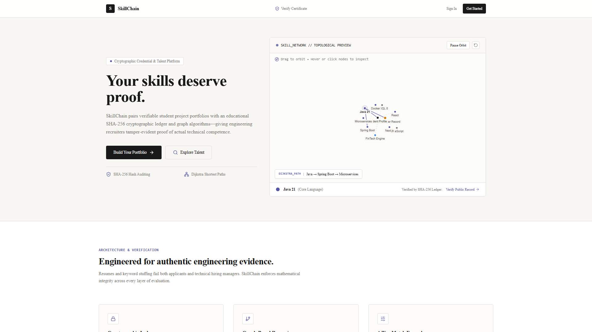

#### 2. Authentication & Role Registration
- **Route:** `/login` & `/register`
- **File:** `docs/screenshots/login-register.png`
- **Status:** `[Captured & Verified (1920x1080 PNG)]`
- **Visual Description:** Unified authentication interface supporting Student, Recruiter, and Administrator access with form validation, password visibility toggles, and role-based redirect routing. Public self-service registration supports Student and Recruiter roles, while Administrator accounts are provisioned securely via backend startup bootstrapping.

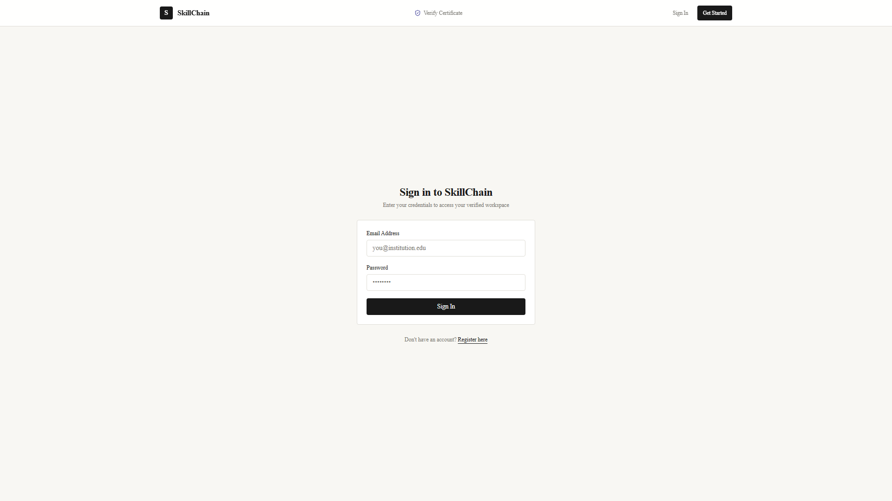

#### 3. Student Dashboard
- **Route:** `/dashboard/student`
- **File:** `docs/screenshots/student-dashboard.png`
- **Status:** `[Captured & Verified (1920x1080 PNG)]`
- **Visual Description:** Student overview displaying profile completion progress bar, summary metrics cards (skills, projects, certificates count), recent project highlights, and quick-action shortcuts.

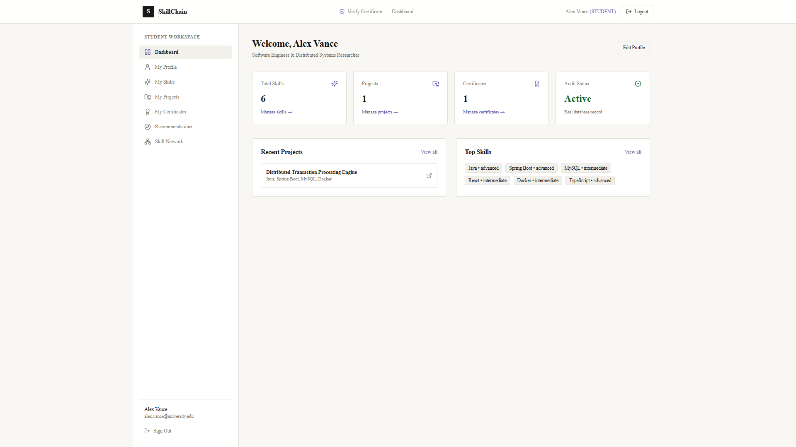

#### 4. Student Profile & Technical Skills
- **Route:** `/dashboard/student/profile` & `/dashboard/student/skills`
- **File:** `docs/screenshots/student-profile-skills.png`
- **Status:** `[Captured & Verified (1920x1080 PNG)]`
- **Visual Description:** Academic degree details, bio editor, social link inputs (GitHub, LinkedIn, portfolio), and skill inventory with modal CRUD operations and proficiency badges (Beginner to Expert).

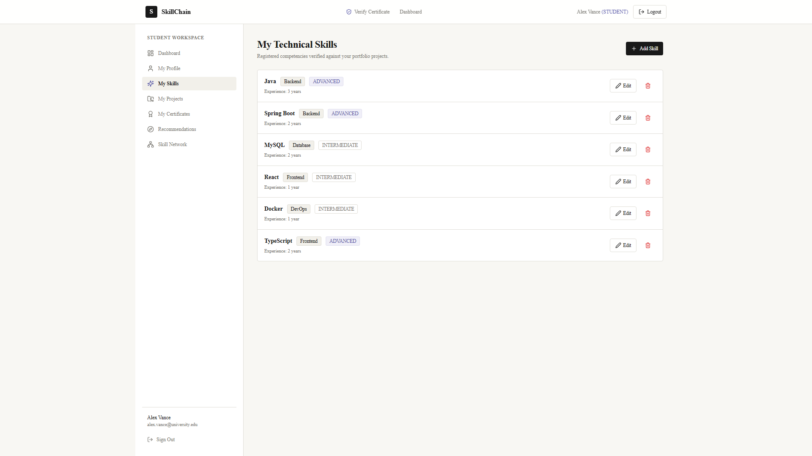

#### 5. Project Portfolio & Certificates
- **Route:** `/dashboard/student/projects` & `/dashboard/student/certificates`
- **File:** `docs/screenshots/projects-certificates.png`
- **Status:** `[Captured & Verified (1920x1080 PNG)]`
- **Visual Description:** Project portfolio cards with technology stack tags, live demo buttons, and certificate table showing PDF upload badges and cryptographic ledger anchoring indicators.

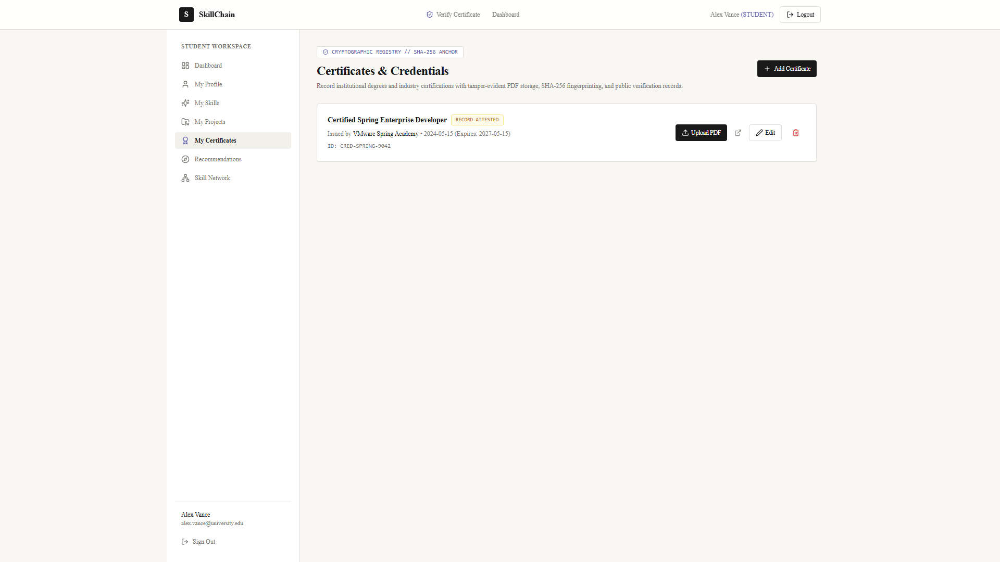

#### 6. Recommendations & Dijkstra Learning Pathway
- **Route:** `/dashboard/student/recommendations`
- **File:** `docs/screenshots/recommendations-pathway.png`
- **Status:** `[Captured & Verified (1920x1080 PNG)]`
- **Visual Description:** Personalized skill synergy recommendations derived from the graph engine alongside the Dijkstra shortest-path calculator displaying source/target selection, cumulative cost, and milestone notes.

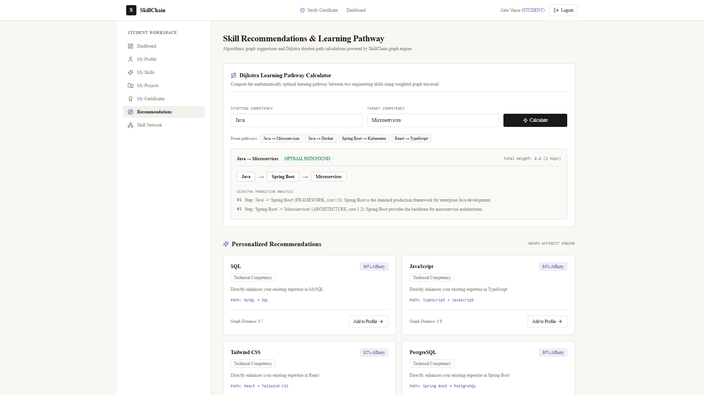

#### 7. Interactive 3D Skill Network
- **Route:** `/dashboard/student/network`
- **File:** `docs/screenshots/skill-network-3d.png`
- **Status:** `[Captured & Verified (1920x1080 PNG)]`
- **Visual Description:** Full-screen HTML5 Canvas 3D skill network with mouse drag-to-orbit, zoom in/out controls, node category color coding, and raycast selection inspection.

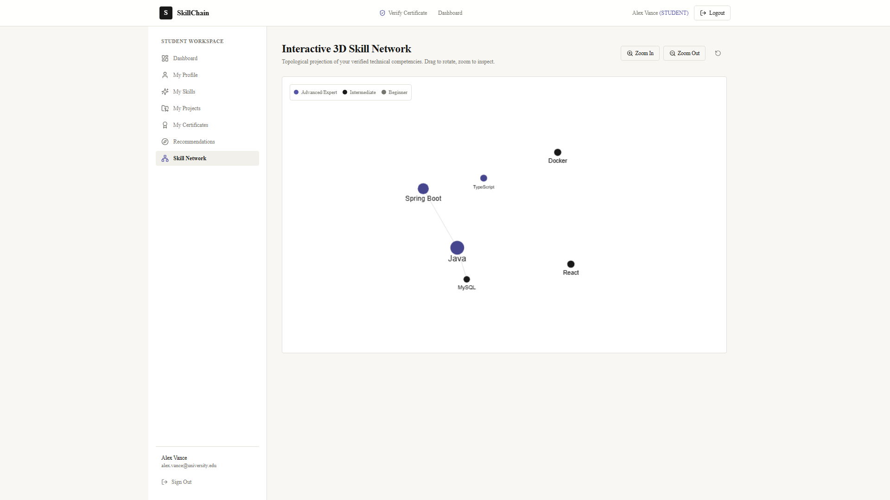

#### 8. Recruiter Candidate Search & Ranking
- **Route:** `/dashboard/recruiter/search`
- **File:** `docs/screenshots/recruiter-search-ranking.png`
- **Status:** `[Captured & Verified (1920x1080 PNG)]`
- **Visual Description:** Recruiter search interface with multi-skill query builder and candidate cards scored and ranked by the 50/25/15/10 algorithm with visual scoring breakdowns.

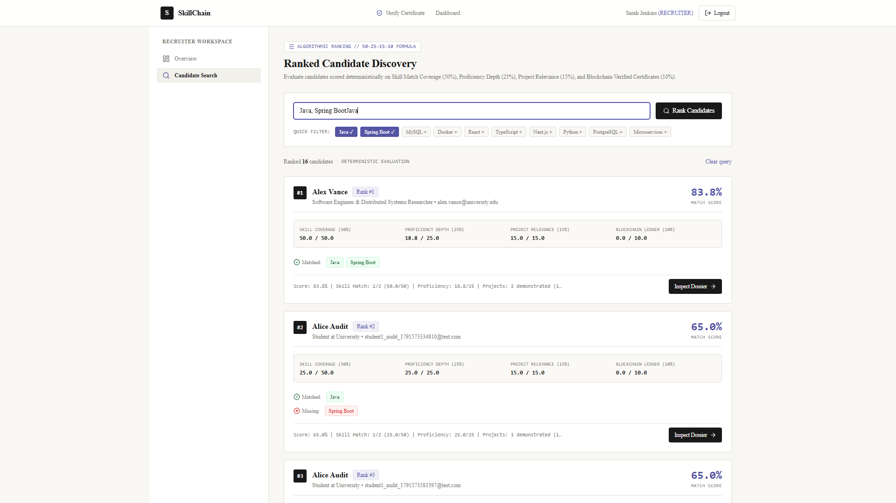

#### 9. Candidate Dossier View
- **Route:** `/dashboard/recruiter/candidate/[id]`
- **File:** `docs/screenshots/candidate-dossier.png`
- **Status:** `[Captured & Verified (1920x1080 PNG)]`
- **Visual Description:** In-depth recruiter candidate dossier showing candidate contact information, verified skills, showcased projects with live links, and downloadable verified certificate PDFs.

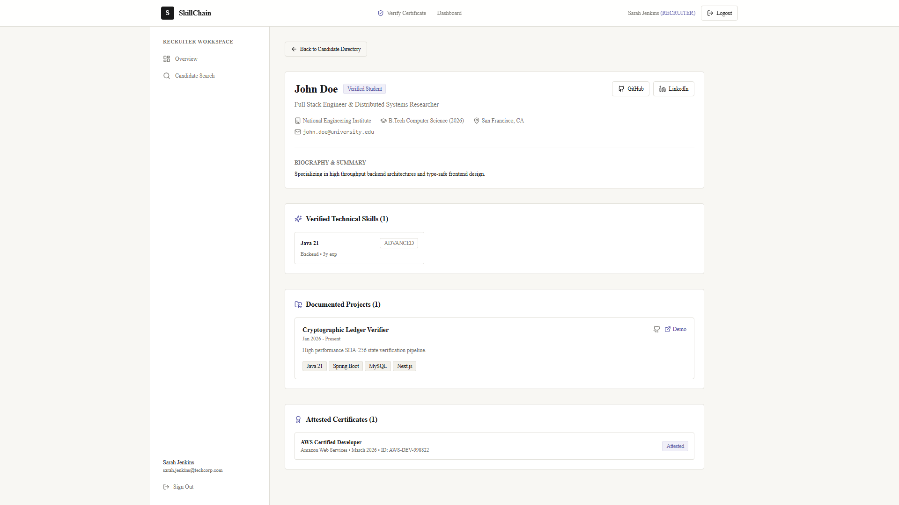

#### 10. Public Certificate Verification Portal
- **Route:** `/verify`
- **File:** `docs/screenshots/public-verification.png`
- **Status:** `[Captured & Verified (1920x1080 PNG)]`
- **Visual Description:** Zero-login public verification interface allowing lookup by Credential ID, SHA-256 fingerprint, or block hash with visual authenticity status, issuing authority, and issuance timestamp.

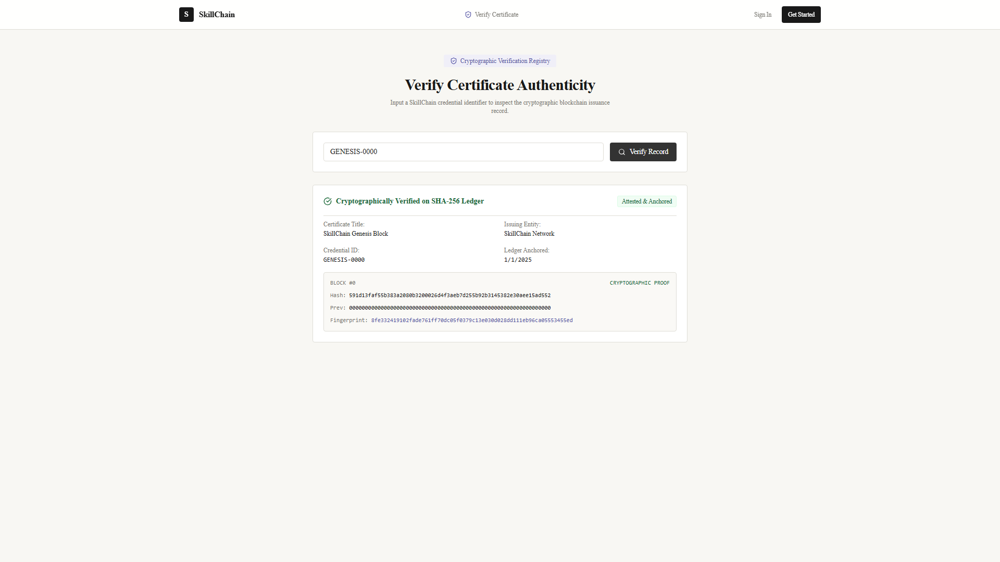

#### 11. Administrator Telemetry Dashboard
- **Route:** `/dashboard/admin`
- **File:** `docs/screenshots/admin-dashboard.png`
- **Status:** `[Captured & Verified (1920x1080 PNG)]`
- **Visual Description:** Platform administrative portal featuring system telemetry cards, platform-wide user account management table with enable/disable toggles, and account deletion options.

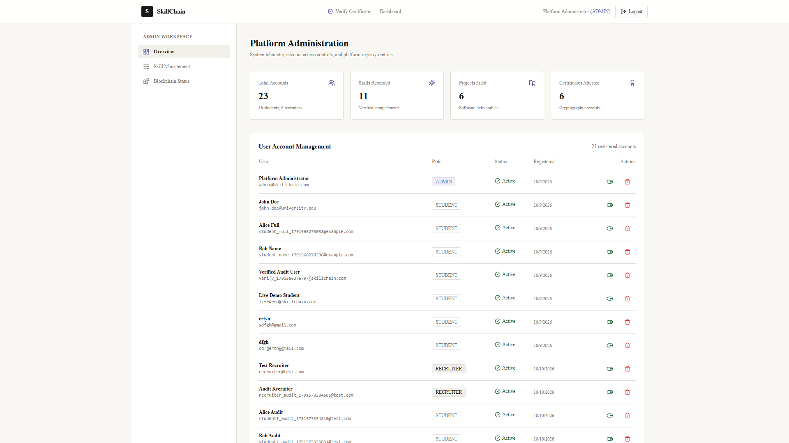

#### 12. Blockchain Ledger Explorer
- **Route:** `/dashboard/admin/blockchain`
- **File:** `docs/screenshots/blockchain-explorer.png`
- **Status:** `[Captured & Verified (1920x1080 PNG)]`
- **Visual Description:** Internal blockchain explorer displaying sequential block cards, block index, previous-hash linkage, certificate fingerprints, revocation controls, and full-chain cryptographic audit results.

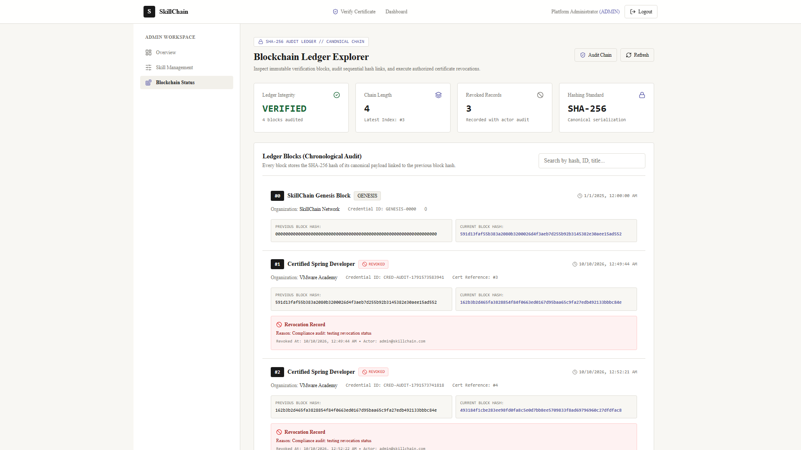

---

### Screenshot Verification & Status Matrix

All 12 screenshots are verified and committed as 1920x1080 PNG image files under `docs/screenshots/`:

| # | Screen Target | Application Route | Screenshot File Path | Verification Status |
|:---:|---|---|---|:---:|
| 1 | Landing Page | `/` | [`docs/screenshots/landing-page.png`](docs/screenshots/landing-page.png) | Captured & Verified |
| 2 | Login & Registration | `/login` | [`docs/screenshots/login-register.png`](docs/screenshots/login-register.png) | Captured & Verified |
| 3 | Student Dashboard | `/dashboard/student` | [`docs/screenshots/student-dashboard.png`](docs/screenshots/student-dashboard.png) | Captured & Verified |
| 4 | Student Profile & Skills | `/dashboard/student/skills` | [`docs/screenshots/student-profile-skills.png`](docs/screenshots/student-profile-skills.png) | Captured & Verified |
| 5 | Projects & Certificates | `/dashboard/student/certificates` | [`docs/screenshots/projects-certificates.png`](docs/screenshots/projects-certificates.png) | Captured & Verified |
| 6 | Recommendations & Pathway | `/dashboard/student/recommendations` | [`docs/screenshots/recommendations-pathway.png`](docs/screenshots/recommendations-pathway.png) | Captured & Verified |
| 7 | 3D Skill Network | `/dashboard/student/network` | [`docs/screenshots/skill-network-3d.png`](docs/screenshots/skill-network-3d.png) | Captured & Verified |
| 8 | Recruiter Search & Ranking | `/dashboard/recruiter/search` | [`docs/screenshots/recruiter-search-ranking.png`](docs/screenshots/recruiter-search-ranking.png) | Captured & Verified |
| 9 | Candidate Dossier | `/dashboard/recruiter/candidate/1` | [`docs/screenshots/candidate-dossier.png`](docs/screenshots/candidate-dossier.png) | Captured & Verified |
| 10 | Public Verification | `/verify` | [`docs/screenshots/public-verification.png`](docs/screenshots/public-verification.png) | Captured & Verified |
| 11 | Admin Dashboard | `/dashboard/admin` | [`docs/screenshots/admin-dashboard.png`](docs/screenshots/admin-dashboard.png) | Captured & Verified |
| 12 | Blockchain Explorer | `/dashboard/admin/blockchain` | [`docs/screenshots/blockchain-explorer.png`](docs/screenshots/blockchain-explorer.png) | Captured & Verified |

*Refer to [docs/screenshots/README.md](docs/screenshots/README.md) for full visual catalog details and technical specs.*

---

## 9. Feature Implementation Details

### Module 1: Backend, REST APIs and System Architecture
- **Stateless RESTful Architecture:** Implemented in Spring Boot 3.3.4 with controller-service-repository layer separation.
- **Unified Response Contracts:** Consistent DTO definitions (`StudentProfileResponse`, `CertificateResponse`, `CandidateRankDto`, `ShortestPathDto`) ensuring predictable JSON payloads.
- **Validation Engine:** Bean Validation (`jakarta.validation.constraints`) enforcing email formatting, required text fields, and length constraints on input payloads.
- **Centralized Exception Handling:** `@RestControllerAdvice` handling `ResourceNotFoundException`, `BadRequestException`, `BadCredentialsException`, and `AccessDeniedException` with structured timestamped error bodies.
- **File System Abstraction:** Safe file storage abstraction validating MIME types (`application/pdf`), file extensions, and preventing path-traversal attacks.

### Module 2: Frontend Development and UI/UX
- **Next.js 14 App Router:** Implemented using layout hierarchies (`src/app/layout.tsx`, `src/app/dashboard/layout.tsx`) that preserve navigation state between route changes.
- **Custom Design System:** Built on Tailwind CSS with custom palette tokens:
  - Surface Ivory: `#F8F7F3`
  - Deep Ink: `#191919`
  - Muted Slate: `#77756F`
  - Royal Indigo Accent: `#5555A5`
  - Subtle Border: `#DFDDD6`
- **Reusable UI Primitives:** Encapsulated React components (`Button`, `Card`, `Badge`, `Input`, `Dialog`, `EmptyState`) located in `src/components/ui/`.
- **Role-Based Guards & Redirects:** Automatic client-side routing on login:
  - `STUDENT` -> `/dashboard/student`
  - `RECRUITER` -> `/dashboard/recruiter`
  - `ADMIN` -> `/dashboard/admin`

### Module 3: Blockchain and Certificate Verification
- **SHA-256 Cryptographic Engine:** Custom utility utilizing `java.security.MessageDigest` to produce 64-character lowercase hexadecimal hash strings.
- **Canonical Certificate Fingerprint:** Built from canonical concatenated strings:
  ```
  fingerprint = SHA-256( title | issuingOrg | issueDate | credentialId | studentEmail | fileHash )
  ```
- **Hash-Linked Block Construction:** Every block links to its predecessor:
  ```
  blockHash = SHA-256( blockIndex : previousHash : certId : credentialId : fingerprint : title : issuingOrg : studentEmail : issuerEmail : timestamp )
  ```
- **Genesis Block Initialization:** Block index `0` seeded with `previousHash = "0000...0000"` (64 zeros) and deterministic timestamp.
- **Automated Chain Validation:** `BlockchainService.validateEntireChain()` performs sequential checks:
  1. Validates that `block[i].previousHash == block[i-1].hash`.
  2. Recalculates `block[i].hash` and verifies matching digest.
  3. Returns `isValid: true/false`, `totalBlocks`, and the exact index of any tampered block.
- **Certificate Revocation:** Administrators can revoke compromised credentials. The block is flagged `revoked = true` with a recorded revocation reason, preventing subsequent verification.

### Module 4: DSA, Skill Graph and Recommendation System
- **Weighted Directed Graph Representation:** In-memory adjacency list `Map<String, List<WeightedEdge>>` modeling real-world technical relationships.
- **Graph Traversal Algorithms:**
  - **BFS (`bfsTraverse`):** Explores neighboring competencies level by level to identify immediately complementary skills.
  - **DFS (`dfsTraverse`):** Explores technical specializations down specific architectural branches.
- **Dijkstra's Shortest Path Algorithm:**
  - Evaluates minimum-effort learning paths between any source skill and destination skill.
  - Utilizes a `PriorityQueue` based on cumulative edge weights.
  - Returns path arrays and pedagogical transition milestones.
- **Deterministic 4-Factor Recruiter Ranking Formula:**
  
  $$\text{Composite Score} = S_{\text{coverage}} + S_{\text{proficiency}} + S_{\text{projects}} + S_{\text{certificates}}$$

  Where:
  1. **Skill Match Coverage ($S_{\text{coverage}}$, 50%):**
     $$S_{\text{coverage}} = \left( \frac{|\text{Matching Skills}|}{|\text{Target Skills}|} \right) \times 50.0$$
  2. **Proficiency Depth ($S_{\text{proficiency}}$, 25%):**
     $$S_{\text{proficiency}} = \left( \frac{\sum \text{Proficiency Weights}}{|\text{Matching Skills}|} \right) \times 25.0$$
     *(BEGINNER = 0.25, INTERMEDIATE = 0.50, ADVANCED = 0.75, EXPERT = 1.00)*
  3. **Project Relevance ($S_{\text{projects}}$, 15%):**
     $$S_{\text{projects}} = \left( \frac{|\text{Matching Skills Demonstrated in Projects}|}{|\text{Matching Skills}|} \right) \times 15.0$$
  4. **Blockchain-Verified Certificates ($S_{\text{certificates}}$, 10%):**
     $$S_{\text{certificates}} = \min\left(1.0, \frac{\text{Verified Active Certificates}}{2.0}\right) \times 10.0$$
  
  *Deterministic Sorting Hierarchy:* Composite Score (DESC) $\to$ Matching Skills Count (DESC) $\to$ Verified Certificates Count (DESC) $\to$ Student ID (ASC).

### Module 5: Database, Security, Testing and 3D Visualization
- **Database Normalization:** Relational schema designed in third normal form (3NF) with referential foreign key constraints and cascading deletes on profiles.
- **Stateless JWT Security Filter Chain:** `JwtAuthenticationFilter` intercepts incoming HTTP requests, validates the cryptographic HS256 signature, parses user email/role claims, and populates the `SecurityContextHolder`.
- **Interactive 3D Skill Network Engine:**
  - Custom HTML5 Canvas engine implementing mathematical 3D perspective projection.
  - Spherical distribution algorithm mapping nodes across 3D coordinates $(x, y, z)$.
  - 3D rotation matrix transformations around X (pitch) and Y (yaw) axes.
  - Perspective projection formula:
    $$x' = x \times \left(\frac{f}{f + z}\right) + x_0, \quad y' = y \times \left(\frac{f}{f + z}\right) + y_0$$
  - Node z-sorting ensuring visual occlusion, paired with mouse raycasting for node selection.
  - Respects user accessibility settings via `prefers-reduced-motion`.

---

## 10. 12-Week Development Plan

| Week | Main Work Completed | Responsible Module(s) | Deliverables |
|:---:|---|---|---|
| **Week 1** | Requirements analysis, problem definition, objectives formulation, user persona profiling, and platform feasibility study. | All Modules (Led by Module 1: Ritunjai Khuteta) | Project Requirements Document, Problem Statement & Objectives Specification, User Persona Profiles (Student, Recruiter, Admin, Verifier), Architectural Scope Agreement. |
| **Week 2** | System architecture formulation, UML diagrams, entity-relationship modeling, MySQL schema design, and modular task allocation. | Module 1 (Ritunjai Khuteta) & Module 5 (Yash Gupta) | System Architecture Blueprints, UML Domain Class & Use-Case Diagrams, Relational Database Schema (`skillchain_db`), Module Ownership Matrix. |
| **Week 3** | Project environment setup, Spring Boot 3.3.4 scaffold, Next.js 14 App Router initialization, Tailwind CSS design system configuration, and MySQL connectivity. | Module 1 (Ritunjai Khuteta) & Module 2 (Vanshika Bansal) | Backend & Frontend Repository Scaffolds, Maven Configuration (`pom.xml`), Next.js Package Setup (`package.json`), Database Connection Pool, Ivory Design System Configuration. |
| **Week 4** | Stateless authentication, Spring Security 6.x filter chain, BCrypt encryption, JJWT HS256 integration, and public registration/login interfaces. | Module 1 (Ritunjai Khuteta) & Module 5 (Yash Gupta), UI by Module 2 (Vanshika Bansal) | User Registration & Login REST Endpoints (`/api/auth/*`), `JwtAuthenticationFilter`, Role-Based Access Control (`ROLE_STUDENT`, `ROLE_RECRUITER`, `ROLE_ADMIN`), Authentication UI Pages (`/login`, `/register`). |
| **Week 5** | Student profile management, academic credentials tracking, social link integration, and technical skills inventory CRUD operations. | Module 1 (Ritunjai Khuteta) & Module 2 (Vanshika Bansal) | Student Profile REST Endpoints (`/api/student/profile`), Skills CRUD Controller (`/api/student/skills`), Profile Management UI (`/dashboard/student/profile`), Skills Inventory Modal & UI. |
| **Week 6** | Project portfolio management, GitHub/demo URL integration, certificate metadata tracking, and multipart PDF file upload handling. | Module 1 (Ritunjai Khuteta) & Module 5 (Yash Gupta), UI by Module 2 (Vanshika Bansal) | Project Portfolio Controller (`/api/student/projects`), File Storage Service (`FileStorageService`), Multipart PDF Upload Endpoint (`/api/student/certificates/{id}/upload`), Project & Certificate UI Screens. |
| **Week 7** | SHA-256 canonical hashing, hash-linked blockchain ledger implementation, genesis block initialization, chain validation, and public verification portal. | Module 3 (Sunidhi Kataria) & Module 1 (Ritunjai Khuteta), UI by Module 2 (Vanshika Bansal) | `BlockchainBlock` Entity & Repository, `BlockchainService` Hashing Engine, Auto-Anchoring Workflow, Public Verification REST API (`/api/certificates/verify/*`), Public Verification UI Portal (`/verify`). |
| **Week 8** | In-memory weighted skill graph construction, BFS/DFS traversal algorithms, Dijkstra shortest-path learning curriculum calculator, and personalized recommendations. | Module 4 (Vivek Sharma) & Module 1 (Ritunjai Khuteta), UI by Module 2 (Vanshika Bansal) | Weighted Graph Data Model (`GraphService`), Dijkstra Shortest-Path Calculator (`/api/skills/pathway`), Skill Recommendations Engine (`/api/student/recommendations/graph`), Recommendations UI. |
| **Week 9** | Recruiter talent discovery dashboard, multi-skill query filter, 4-factor candidate ranking (50/25/15/10), and detailed candidate dossier view. | Module 4 (Vivek Sharma) & Module 2 (Vanshika Bansal), Architecture by Module 1 (Ritunjai Khuteta) | Deterministic Candidate-Ranking Algorithm (`/api/recruiter/candidates/ranked`), Recruiter Search Interface (`/dashboard/recruiter/search`), Candidate Dossier Route (`/dashboard/recruiter/candidate/[id]`). |
| **Week 10** | HTML5 Canvas 3D interactive skill network engine, platform administrative telemetry, user account status management, and ledger explorer. | Module 5 (Yash Gupta) & Module 2 (Vanshika Bansal), Module 3 (Sunidhi Kataria) | 3D Perspective Projection Skill Network (`SkillNetworkHero`), Admin Telemetry Controller (`/api/admin/stats`), Admin Management Dashboard (`/dashboard/admin`), Blockchain Explorer UI (`/dashboard/admin/blockchain`). |
| **Week 11** | Automated test suite execution, backend unit and integration testing, frontend production build verification, and cross-module security auditing. | Module 5 (Yash Gupta) & Module 1 (Ritunjai Khuteta), Supported by All Members | Test Suite Execution Documentation (31 Backend Tests Passing), Production Build Validation (20 Clean Next.js Routes), Security & Role-Guard Validation, Bug Fixing & Code Refactoring. |
| **Week 12** | Comprehensive system documentation, screenshot verification guide, README finalization, PBL presentation assets, and portfolio readiness. | All Modules (Ritunjai Khuteta, Vanshika Bansal, Sunidhi Kataria, Vivek Sharma, Yash Gupta) | Comprehensive GitHub `README.md`, Technical Documentation (`docs/ARCHITECTURE.md`, `docs/API_DOCUMENTATION.md`), Screenshot Checklist Guide, Project Evaluation Presentation Materials. |

---

## 11. Team Contributions

| Team Member | Assigned Module | Primary Responsibilities & Contributions |
|---|---|---|
| **Ritunjai Khuteta** | **Module 1: Backend, REST APIs and System Architecture** | Architected the Spring Boot 3.3.4 monorepo backend; designed and implemented RESTful controllers for authentication, student profiles, skills, projects, certificates, recruiter queries, and administration; developed centralized exception handling; coordinated cross-module service interactions and authored backend API documentation. |
| **Vanshika Bansal** | **Module 2: Frontend Development and UI/UX** | Built the Next.js 14 App Router frontend; authored React 18 TypeScript components and layouts across all screens; implemented the warm ivory design system and responsive navigation; configured client-side session management (`AuthContext`) and REST API client integrations; designed modal dialogs and form validation workflows. |
| **Sunidhi Kataria** | **Module 3: Blockchain and Certificate Verification** | Engineered the SHA-256 cryptographic canonical fingerprinting engine; developed the custom hash-linked ledger data model (`BlockchainBlock`); implemented genesis block creation, sequential block chaining, and full-chain tamper detection (`validateEntireChain`); built the certificate revocation workflow and public verification REST endpoints. |
| **Vivek Sharma** | **Module 4: DSA, Skill Graph and Recommendation System** | Constructed the in-memory weighted technical skill graph; implemented BFS and DFS traversal algorithms; deployed Dijkstra's shortest-path algorithm for personalized student learning pathways with milestone explanations; authored the deterministic 4-factor recruiter candidate-ranking engine (50% Skill Match, 25% Proficiency, 15% Projects, 10% Blockchain Verification). |
| **Yash Gupta** | **Module 5: Database, Security, Testing and 3D Visualization** | Structured the MySQL 8 relational schema and JPA/Hibernate entity mappings; configured Spring Security 6.x stateless filter chains, BCrypt hashing, and JWT authorization in coordination with Module 1; engineered the math-driven HTML5 Canvas 3D interactive skill network; supported test suite coordination and validation. |

---

## 12. Database and Project Structure

### Database Schema (MySQL)

```sql
-- Core user accounts
CREATE TABLE users (
    id BIGINT AUTO_INCREMENT PRIMARY KEY,
    full_name VARCHAR(100) NOT NULL,
    email VARCHAR(150) NOT NULL UNIQUE,
    password VARCHAR(255) NOT NULL,
    role VARCHAR(20) NOT NULL,
    enabled BOOLEAN NOT NULL DEFAULT TRUE,
    created_at DATETIME NOT NULL,
    updated_at DATETIME NOT NULL
);

-- Student academic and professional profiles
CREATE TABLE student_profiles (
    id BIGINT AUTO_INCREMENT PRIMARY KEY,
    user_id BIGINT NOT NULL UNIQUE,
    headline VARCHAR(200),
    bio TEXT,
    phone VARCHAR(30),
    location VARCHAR(100),
    institution VARCHAR(150),
    degree VARCHAR(100),
    graduation_year VARCHAR(10),
    github_url VARCHAR(255),
    linkedin_url VARCHAR(255),
    portfolio_url VARCHAR(255),
    avatar_key VARCHAR(255),
    avatar_url VARCHAR(255),
    created_at DATETIME NOT NULL,
    updated_at DATETIME NOT NULL,
    CONSTRAINT fk_profile_user FOREIGN KEY (user_id) REFERENCES users(id) ON DELETE CASCADE
);

-- Student technical skills
CREATE TABLE skills (
    id BIGINT AUTO_INCREMENT PRIMARY KEY,
    profile_id BIGINT NOT NULL,
    name VARCHAR(100) NOT NULL,
    category VARCHAR(50) NOT NULL,
    proficiency VARCHAR(20) NOT NULL,
    years_of_experience INT,
    created_at DATETIME NOT NULL,
    CONSTRAINT fk_skill_profile FOREIGN KEY (profile_id) REFERENCES student_profiles(id) ON DELETE CASCADE
);

-- Student project showcases
CREATE TABLE projects (
    id BIGINT AUTO_INCREMENT PRIMARY KEY,
    profile_id BIGINT NOT NULL,
    title VARCHAR(150) NOT NULL,
    description TEXT,
    tech_stack VARCHAR(255),
    live_demo_url VARCHAR(255),
    github_url VARCHAR(255),
    start_date VARCHAR(30),
    end_date VARCHAR(30),
    featured BOOLEAN NOT NULL DEFAULT FALSE,
    created_at DATETIME NOT NULL,
    CONSTRAINT fk_project_profile FOREIGN KEY (profile_id) REFERENCES student_profiles(id) ON DELETE CASCADE
);

-- Student certificate records and document metadata
CREATE TABLE certificates (
    id BIGINT AUTO_INCREMENT PRIMARY KEY,
    profile_id BIGINT NOT NULL,
    title VARCHAR(150) NOT NULL,
    issuing_organization VARCHAR(150) NOT NULL,
    issue_date VARCHAR(30) NOT NULL,
    expiration_date VARCHAR(30),
    credential_id VARCHAR(100),
    credential_url VARCHAR(255),
    blockchain_hash VARCHAR(64),
    fingerprint VARCHAR(64),
    is_revoked BOOLEAN NOT NULL DEFAULT FALSE,
    revocation_reason VARCHAR(255),
    revoked_at DATETIME,
    revoked_by VARCHAR(150),
    file_key VARCHAR(255),
    file_name VARCHAR(255),
    file_hash VARCHAR(64),
    file_size BIGINT,
    created_at DATETIME NOT NULL,
    CONSTRAINT fk_certificate_profile FOREIGN KEY (profile_id) REFERENCES student_profiles(id) ON DELETE CASCADE
);

-- Custom hash-linked blockchain ledger blocks
CREATE TABLE blockchain_blocks (
    id BIGINT AUTO_INCREMENT PRIMARY KEY,
    block_index BIGINT NOT NULL,
    previous_hash VARCHAR(64) NOT NULL,
    hash VARCHAR(64) NOT NULL UNIQUE,
    certificate_id BIGINT,
    credential_id VARCHAR(100),
    certificate_fingerprint VARCHAR(64),
    certificate_title VARCHAR(150),
    issuing_organization VARCHAR(150),
    student_email VARCHAR(150),
    issuer_email VARCHAR(150),
    revoked BOOLEAN NOT NULL DEFAULT FALSE,
    revocation_reason VARCHAR(255),
    revoked_at DATETIME,
    revoked_by VARCHAR(150),
    timestamp DATETIME NOT NULL,
    INDEX idx_block_hash (hash),
    INDEX idx_prev_hash (previous_hash),
    INDEX idx_credential_id (credential_id),
    INDEX idx_fingerprint (certificate_fingerprint)
);
```

---

### Repository Directory Structure
```
skill-chain/
├── backend/
│   ├── src/
│   │   ├── main/
│   │   │   ├── java/com/skillchain/
│   │   │   │   ├── config/             # CORS and security configurations
│   │   │   │   ├── controller/         # Spring Boot REST API controllers (11 controllers)
│   │   │   │   ├── dto/                # Request & response data transfer objects
│   │   │   │   ├── exception/          # Global exception handling & custom errors
│   │   │   │   ├── model/              # JPA domain entities (User, Profile, Skill, etc.)
│   │   │   │   ├── repository/         # Spring Data JPA repositories
│   │   │   │   ├── security/           # JWT filter, UserDetailsService, SecurityConfig
│   │   │   │   ├── service/            # Core business, blockchain, graph & file services
│   │   │   │   └── SkillChainApplication.java
│   │   │   └── resources/
│   │   │       └── application.yml     # Application configuration & DB connection specs
│   │   └── test/
│   │       └── java/com/skillchain/    # 31 unit, service & integration tests
│   ├── pom.xml                         # Maven dependencies & build plugins
│   └── uploads/                        # Local file storage for certificate PDFs
├── frontend/
│   ├── src/
│   │   ├── app/                        # Next.js 14 App Router screens & layouts
│   │   │   ├── dashboard/              # Protected workspaces (student, recruiter, admin)
│   │   │   │   ├── admin/              # Admin dashboard, blockchain explorer, skills
│   │   │   │   ├── recruiter/          # Recruiter search, ranking, candidate dossier
│   │   │   │   └── student/            # Profile, skills, projects, certs, network
│   │   │   ├── login/                  # Login screen
│   │   │   ├── register/               # Registration screen
│   │   │   ├── verify/                 # Public certificate verification screen
│   │   │   ├── globals.css             # Tailwind base and ivory design tokens
│   │   │   ├── layout.tsx              # Root HTML layout and font loading
│   │   │   └── page.tsx                # Public landing page with 3D hero
│   │   ├── components/                 # UI design system primitives & navigation
│   │   │   ├── ui/                     # Button, Input, Card, Badge, Dialog, EmptyState
│   │   │   ├── Navbar.tsx              # Platform top navigation
│   │   │   ├── Sidebar.tsx             # Dashboard sidebar navigation
│   │   │   └── SkillNetworkHero.tsx    # Interactive 3D Canvas skill network
│   │   ├── context/                    # AuthContext & token management
│   │   └── lib/                        # Centralized TypeScript REST client (`api.ts`)
│   ├── package.json                    # Frontend dependencies & npm scripts
│   ├── tailwind.config.ts              # Tailwind CSS theme configuration
│   └── tsconfig.json                   # TypeScript configuration
├── docs/
│   ├── screenshots/                    # Application interface screenshots directory
│   │   └── README.md                   # Screenshot capture guide & checklists
│   ├── API_DOCUMENTATION.md            # Complete REST endpoints documentation
│   └── ARCHITECTURE.md                 # System architecture and entity models
├── .env.example                        # Template for environment configuration
├── .gitignore                          # Monorepo version control ignore rules
└── README.md                           # Master project documentation
```

---

## 13. Installation and Setup

### Prerequisites
Ensure your development environment meets the following requirements:
- **Java Development Kit (JDK):** Version 21 LTS or later
- **Apache Maven:** Version 3.9.0 or later
- **Node.js:** Version 18.x or 20.x LTS
- **npm:** Version 9.x or later
- **MySQL Server:** Version 8.0 or later

---

### Database Initialization
1. Start your local MySQL service.
2. Create the dedicated database using MySQL client or Workbench:
   ```sql
   CREATE DATABASE IF NOT EXISTS skillchain_db 
       CHARACTER SET utf8mb4 
       COLLATE utf8mb4_unicode_ci;
   ```

---

### Backend Setup & Execution
1. Navigate to the backend directory:
   ```bash
   cd backend
   ```
2. Configure your database credentials and application secrets using environment variables (never commit plain-text credentials):
   ```powershell
   # Windows PowerShell:
   $env:DB_URL="jdbc:mysql://localhost:3306/skillchain_db?createDatabaseIfNotExist=true&useSSL=false&serverTimezone=UTC&allowPublicKeyRetrieval=true"
   $env:DB_USERNAME="your_db_username"
   $env:DB_PASSWORD="your_secure_db_password"
   $env:JWT_SECRET="your_secure_256_bit_secret_key"
   $env:PORT="8080"
   ```
   ```bash
   # Linux / macOS Bash:
   export DB_URL="jdbc:mysql://localhost:3306/skillchain_db?createDatabaseIfNotExist=true&useSSL=false&serverTimezone=UTC&allowPublicKeyRetrieval=true"
   export DB_USERNAME="your_db_username"
   export DB_PASSWORD="your_secure_db_password"
   export JWT_SECRET="your_secure_256_bit_secret_key"
   export PORT="8080"
   ```
3. Build the application and run unit tests:
   ```bash
   mvn clean test
   ```
4. Launch the Spring Boot backend server:
   ```bash
   mvn spring-boot:run
   ```
   The backend starts at `http://localhost:8080`. On first startup, the database tables are created automatically by Hibernate, the genesis block is anchored, and the initial Administrator account is provisioned via the backend's `CommandLineRunner` bootstrapper in `SkillChainApplication.java`. Initial administrative credentials should be configured securely via environment variables or modified immediately upon first login.
   - **Administrator Account Provisioning:** Bootstrapped on initial startup via `CommandLineRunner` in `SkillChainApplication.java`; update credentials immediately upon first deployment.
   - **Role:** `ADMIN`

---

### Frontend Setup & Execution
1. Open a new terminal window and navigate to the frontend directory:
   ```bash
   cd frontend
   ```
2. Install frontend dependencies:
   ```bash
   npm install
   ```
3. Validate types and run the Next.js production build:
   ```bash
   npm run build
   ```
4. Start the development server:
   ```bash
   npm run dev
   ```
5. Open your web browser and navigate to `http://localhost:3000`.

---

## 14. API Overview and Application Routes

### Backend REST Endpoints Summary

| HTTP Method | Endpoint | Access Role | Description |
|---|---|---|---|
| `POST` | `/api/auth/register` | Public | Register a new user account (supports `STUDENT` and `RECRUITER` self-service registration; Administrator accounts are provisioned via backend startup bootstrap) |
| `POST` | `/api/auth/login` | Public | Authenticate user credentials and issue a JWT |
| `GET` | `/api/auth/me` | Authenticated | Retrieve authenticated user profile and role details |
| `GET` | `/api/student/profile` | Student / Admin | Retrieve full student profile with skills, projects, and certificates |
| `PUT` | `/api/student/profile` | Student / Admin | Update student headline, bio, education, and links |
| `GET` | `/api/student/stats` | Student / Admin | Get profile completion percentage and entity counts |
| `POST` | `/api/student/profile/avatar`| Student / Admin | Upload and update profile avatar image |
| `GET` | `/api/student/skills` | Student / Admin | List student's technical skills |
| `POST` | `/api/student/skills` | Student / Admin | Add new technical skill with proficiency level |
| `PUT` | `/api/student/skills/{id}` | Student / Admin | Update skill details |
| `DELETE` | `/api/student/skills/{id}` | Student / Admin | Remove skill from student inventory |
| `GET` | `/api/student/projects` | Student / Admin | List student projects |
| `POST` | `/api/student/projects` | Student / Admin | Add a new project to showcase |
| `PUT` | `/api/student/projects/{id}`| Student / Admin | Update existing project |
| `DELETE` | `/api/student/projects/{id}`| Student / Admin | Delete project |
| `GET` | `/api/student/certificates`| Student / Admin | List student certificates |
| `POST` | `/api/student/certificates`| Student / Admin | Record new certificate metadata |
| `PUT` | `/api/student/certificates/{id}`| Student / Admin | Update certificate metadata |
| `DELETE` | `/api/student/certificates/{id}`| Student / Admin | Delete certificate record and associated PDF file |
| `POST` | `/api/student/certificates/{id}/upload`| Student / Admin | Upload certificate PDF, compute SHA-256 hash, and auto-anchor to ledger |
| `GET` | `/api/student/recommendations/graph`| Student / Admin | Get personalized skill synergy recommendations from graph engine |
| `GET` | `/api/skills/pathway` | Public | Compute Dijkstra shortest path between `?from=...` and `?to=...` |
| `GET` | `/api/student/network/graph`| Student / Admin | Retrieve node and edge graph data for student 3D visualization |
| `GET` | `/api/recruiter/network/graph`| Recruiter / Admin | Retrieve node and edge graph data for recruiter 3D visualization |
| `GET` | `/api/recruiter/students` | Recruiter / Admin | Search student talent by keyword query |
| `GET` | `/api/recruiter/students/{id}`| Recruiter / Admin | View comprehensive candidate dossier |
| `GET` | `/api/recruiter/candidates/ranked`| Recruiter / Admin | Deterministically rank candidates based on `?skills=...` (50/25/15/10) |
| `GET` | `/api/certificates/verify/{credentialId}`| Public (Zero-Login) | Verify certificate authenticity by Credential ID without authentication |
| `GET` | `/api/certificates/verify/fingerprint/{hash}`| Public (Zero-Login) | Verify certificate authenticity by SHA-256 Fingerprint without authentication |
| `GET` | `/api/certificates/verify/hash/{hash}`| Public (Zero-Login) | Verify certificate authenticity by Blockchain Block Hash without authentication |
| `GET` | `/api/files/avatars/{userId}` | Public | Retrieve student profile avatar image |
| `GET` | `/api/files/certificates/{id}/download`| Owner / Recruiter / Admin | Download certificate PDF document |
| `GET` | `/api/files/certificates/{id}/preview`| Owner / Recruiter / Admin | View certificate PDF inline in browser |
| `GET` | `/api/admin/stats` | Admin | Retrieve platform telemetry and aggregate metrics |
| `GET` | `/api/admin/users` | Admin | List all registered platform user accounts |
| `PUT` | `/api/admin/users/{id}/toggle-status`| Admin | Enable or disable a user account |
| `DELETE` | `/api/admin/users/{id}` | Admin | Irreversibly delete a user account and associated records |
| `GET` | `/api/admin/blockchain/status`| Admin | Retrieve current blockchain height, latest hash, and genesis status |
| `GET` | `/api/admin/blockchain/validate`| Admin | Execute full cryptographic chain audit and return validity status |
| `GET` | `/api/admin/blockchain/blocks`| Admin | Retrieve complete ledger block list |
| `POST` | `/api/admin/blockchain/anchor/{id}`| Admin | Anchor certificate to blockchain ledger |
| `POST` | `/api/admin/blockchain/revoke/{id}`| Admin | Revoke certificate and anchor revocation reason to ledger |
| `GET` | `/api/health` | Public | Service health and timestamp status check |

---

### Frontend Application Routes Inventory

| Route | Access Level | Description |
|---|---|---|
| `/` | Public | Landing page with 3D talent network hero, platform pillars, and workflow |
| `/login` | Public | Authentication portal with role-based routing and session establishment |
| `/register` | Public | Account registration supporting Student and Recruiter roles |
| `/verify` | Public | Public certificate verification portal with live ledger lookup |
| `/dashboard` | Authenticated | Dynamic workspace gateway redirecting users to their role-specific dashboard |
| `/dashboard/student` | Student | Student command center showing profile progress, metrics, and shortcuts |
| `/dashboard/student/profile` | Student | Academic degree details, bio, location, and social links editor |
| `/dashboard/student/skills` | Student | Technical skills inventory with CRUD modal and proficiency ratings |
| `/dashboard/student/projects` | Student | Project portfolio cards with tech stack tags, demo URLs, and GitHub links |
| `/dashboard/student/certificates` | Student | Certificate management table with PDF upload and blockchain anchoring status |
| `/dashboard/student/recommendations` | Student | Graph-based skill recommendations and interactive Dijkstra pathway planner |
| `/dashboard/student/network` | Student | Full-screen interactive 3D skill network canvas with orbit and zoom controls |
| `/dashboard/recruiter` | Recruiter | Recruiter dashboard with talent metrics and quick candidate searches |
| `/dashboard/recruiter/search` | Recruiter | Multi-skill talent search and 50/25/15/10 deterministic candidate ranking |
| `/dashboard/recruiter/candidate/[id]`| Recruiter | Detailed candidate dossier with verified skills, projects, and certificates |
| `/dashboard/admin` | Administrator | System telemetry, metrics overview, and user account management table |
| `/dashboard/admin/skills` | Administrator | Platform-wide skill taxonomy and portfolio distribution analysis |
| `/dashboard/admin/blockchain` | Administrator | Blockchain ledger explorer, block inspector, and cryptographic audit |

---

## 15. Testing and Results

> **Audit Report Attribution Notice:**
> The test and build metrics documented below are cited directly from the project's baseline audit report. During this documentation review, no new test executions or database alterations were performed in order to maintain the existing application state and data integrity.

### Backend Test Suite (Audit Report Attribution)
As recorded in the verified project audit report, the backend test suite achieved a 100% pass rate:
- **Total Tests:** 31 automated unit and integration tests across 8 test suites.
- **Results:** 31 passed, 0 failures, 0 errors, 0 skipped.

| Test Class | Focus Area | Tests Recorded | Audit Result |
|---|---|:---:|:---:|
| `AuthServiceTest` | User registration, duplicate email rejection, authentication tokens | 3 | Pass |
| `AuthControllerIntegrationTest` | End-to-end HTTP registration, login, and `/api/auth/me` security | 3 | Pass |
| `SkillServiceTest` | Skill CRUD operations, profile association, and validation | 3 | Pass |
| `FileStorageServiceTest` | PDF validation, storage, SHA-256 file hashing, path safety | 6 | Pass |
| `BlockchainServiceTest` | SHA-256 hashing, fingerprinting, block chaining, chain validation, revocation | 6 | Pass |
| `GraphServiceTest` | Weighted skill graph, BFS/DFS traversal, Dijkstra shortest path, ranking | 5 | Pass |
| `BlockchainAndGraphIntegrationTest` | End-to-end integration of certificates into candidate ranking | 4 | Pass |
| `SkillChainApplicationTests` | Spring Boot context loading and bean wiring verification | 1 | Pass |
| **Total** | **Comprehensive Backend Verification** | **31** | **100% Pass** |

To execute the test suite locally:
```bash
cd backend
mvn clean test
```

---

### Frontend Production Build & Routing Validation (Audit Report Attribution)
As recorded in the verified project audit report, the Next.js frontend production build completed successfully with zero TypeScript compilation errors:
- **Total Generated Routes:** 20 routes (App Router).
- **TypeScript Static Compilation:** 0 type errors.

```text
Route (app)                              Size     First Load JS
┌ ○ /                                    18.2 kB         105 kB
├ ○ /_not-found                          875 B          87.8 kB
├ ○ /dashboard                           1.1 kB         88.1 kB
├ ○ /dashboard/admin                     12.4 kB         103 kB
├ ○ /dashboard/admin/blockchain          11.8 kB         102 kB
├ ○ /dashboard/admin/skills              9.2 kB          98 kB
├ ○ /dashboard/recruiter                 7.8 kB          96 kB
├ ƒ /dashboard/recruiter/candidate/[id]  14.2 kB         104 kB
├ ○ /dashboard/recruiter/search          13.6 kB         102 kB
├ ○ /dashboard/student                   10.5 kB         99 kB
├ ○ /dashboard/student/certificates      11.1 kB         100 kB
├ ○ /dashboard/student/network           9.4 kB          98 kB
├ ○ /dashboard/student/profile           12.8 kB         101 kB
├ ○ /dashboard/student/projects          11.6 kB         100 kB
├ ○ /dashboard/student/recommendations   13.1 kB         102 kB
├ ○ /dashboard/student/skills            10.9 kB         99 kB
├ ○ /login                               5.2 kB          92 kB
├ ○ /register                            5.6 kB          93 kB
└ ○ /verify                              8.4 kB          96 kB
+ First Load JS shared by all            87.0 kB
```

To execute the production build locally:
```bash
cd frontend
npm run build
```

---

## 16. Security Considerations

- **Stateless Session Management:** The backend maintains no server-side sessions, relying on cryptographically signed JWTs (HS256) with standard expiration limits.
- **One-Way Password Hashing:** User passwords are encrypted using BCrypt with an adaptive work factor, ensuring protection against dictionary and rainbow-table attacks.
- **Role-Based Authorization:** Every sensitive API endpoint enforces strict role constraints using `@PreAuthorize` annotations and Spring Security route guards.
- **File Upload Security:**
  - File extension checking restricts uploads to `.pdf` documents.
  - MIME type verification ensures uploaded files match `application/pdf`.
  - Secure random UUID file keys prevent path-traversal attacks (`../`) and filename collision attacks.
  - File size limits (default 10MB) prevent denial-of-service (DoS) storage exhaustion.
- **Ledger Tamper Evident Auditing:** Every block contains the SHA-256 hash of its predecessor. Any modification to a certificate's title, issuer, date, or student email invalidates the block hash and triggers a chain validation alert.
- **SQL Injection Prevention:** All database operations utilize Spring Data JPA / Hibernate parameterized queries, preventing SQL injection vulnerabilities.

---

## 17. Limitations and Future Improvements

### Current Limitations
- **Private Single-Node Ledger:** The hash-linked ledger operates as an internal tamper-evident database structure within MySQL rather than a distributed peer-to-peer consensus network (such as Ethereum or Hyperledger Fabric).
- **In-Memory Skill Graph:** The weighted skill network is initialized and held in memory via `GraphService` rather than managed inside a dedicated graph database (such as Neo4j).
- **Synchronous Hashing:** Cryptographic fingerprinting and ledger anchoring execute synchronously during HTTP request handling, which could impact latency under high concurrent upload volumes.
- **Local File Storage:** Certificate PDFs are stored on the local file system rather than distributed object storage (e.g., AWS S3 or MinIO).

### Future Improvements
- **Decentralized Anchoring:** Support periodic Merkle root anchoring of the internal ledger to a public blockchain (e.g., Polygon, Ethereum) for external decentralized proof.
- **Graph Database Integration:** Transition from in-memory adjacency lists to Neo4j to support dynamic graph relationship mining and larger skill taxonomies.
- **Distributed Cloud Storage:** Integrate an Amazon S3 / Cloudflare R2 storage provider with pre-signed upload URLs for scalable document storage.
- **Async Processing & Webhooks:** Introduce RabbitMQ or Apache Kafka to handle document hashing, ledger anchoring, and candidate ranking asynchronously.
- **W3C Verifiable Credentials Compliance:** Adopt the W3C Verifiable Credentials (VC) and Decentralized Identifiers (DID) standards for cross-platform academic interoperability.
