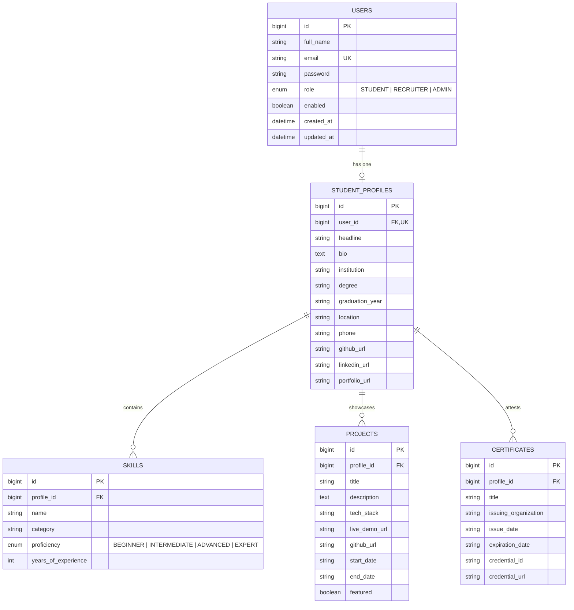

# SkillChain Architecture — Phase 1

## Architectural Overview

SkillChain is an enterprise-grade talent discovery and verifiable credential platform designed with a clean decoupled monorepo architecture:

```
skill-chain/
├── backend/            # Java 21 / Spring Boot 3.3.4 / Maven / MySQL
├── frontend/           # Next.js 14 App Router / TypeScript / Tailwind CSS / Design System
├── docs/               # System & API Documentation
├── .gitignore          # Monorepo ignore rules
├── .env.example        # Environment variables reference
└── README.md           # Setup and execution guide
```

---

## 1. Backend Architecture

- **Language & Runtime:** Java 21 LTS
- **Framework:** Spring Boot 3.3.4
- **Database:** MySQL 8.0 (`skillchain_db`), configured exclusively through environment variables.
- **ORM / Persistence:** Spring Data JPA with Hibernate, optimistic updates, and relational referential integrity.
- **Security:**
  - Spring Security 6.x stateless filter chain (`JwtAuthenticationFilter`).
  - Passwords hashed using BCrypt (`BCryptPasswordEncoder`).
  - JJWT 0.12.6 with HS256 HMAC digital signatures.
  - Role-based authorization (`ROLE_STUDENT`, `ROLE_RECRUITER`, `ROLE_ADMIN`).
- **Error Handling:** Centralized `@RestControllerAdvice` emitting standardized JSON responses (`ErrorResponse`) with HTTP status codes and detailed field-level validation maps.

---

## 2. Frontend Architecture

- **Framework:** Next.js 14 (App Router)
- **Language:** TypeScript 5.x
- **Styling:** Tailwind CSS tailored to the mandatory warm ivory visual identity:
  - Background: `#F8F7F3`
  - Text: `#191919`
  - Muted Text: `#77756F`
  - Accent: `#5555A5`
  - Borders: `#DFDDD6`
  - Card/Surface: `#FFFFFF`
- **State & Authentication:** Context-driven `AuthProvider` caching JWT in `localStorage` and attaching Bearer headers to all client requests.
- **Components:** Accessible primitives (`Button`, `Input`, `Textarea`, `Card`, `Badge`, `Dialog`, `EmptyState`, `Navbar`, `Sidebar`).
- **Data Flow:** Fully connected to the live Spring Boot REST API. Zero mock data, zero Firebase/Supabase.

---

## 3. Data Model Diagram


